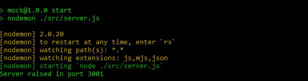

# **💪 HW3 | Sequelize Part 1 - Integration**

## **🕒 DURACIÓN ESTIMADA**

XX minutos

<br />

---

<div align="center">

## **💻 RICK AND MORTY APP 💻**

</div>

## **📝 INTRODUCCIÓN**

En esta homework pondremos en práctica todo lo que hemos aprendido hasta ahora sobre Sequelize. Aplicaremos nuestros conocimientos para conectar nuestro código con una nueva base de datos para nuestro proyecto de Rick & Morty.

</br >

---

## **📋 INSTRUCCIONES**

### **👩‍💻 EJERCICIO 01 | Dependencias & Config**

Lo primero que deberás hacer es instalar las siguientes dependencias en tu **`package.json`**:

-  **sequelize**
-  **pg**
-  **dotenv**

Una vez las hayas instalado tendrás que crear la base de datos en PostgreSQL. Para crear la base de datos puedes optar por utilizar directamente **`pgAdmin`**. En el caso de que quieras hacerlo por terminal sigue estos pasos:

> ⚠️ [**IMPORTANTE**]: es muy importante que el nombre de la base de datos sea: **`rickandmorty`**. En el caso de no cumplir esto la homework puede fallar.

1. Abre la terminal **`SQL Shell (psql)`** e ingresa tu información personal.

2. Crea una base de datos con el nombre **`rickandmorty`** utilizando el comando que ya conoces.

   Puedes verificar que se haya creado correctamente con el comando:

   ```SQL
      \l
   ```

<br />

---

### **👩‍💻 EJERCICIO 02 | ENV**

Dirígete a la raíz de tu proyecto Back-End. Allí deberás crea un archivo llamado **`.env`**. En su interior debes escribir lo siguiente:

```js
DB_USER=postgres
DB_PASSWORD= ---> // ¡Aquí va tu contraseña!
DB_HOST=localhost
```

<br />

---

### **👩‍💻 EJERCICIO 03 | DB Connection**

Ya tenemos todo lo necesario para comenzar a trabajar. Comenzaremos por conectar el código con nuestra base de datos. Para esto:

1. Lleva el archivo [**DB_connection**](./DB_connection.js) a tu carpeta **src**.

2. Dentro de él encontrás el siguiente paso a seguir.

> [**NOTA**]: revisa el código comentado en la sección **`Ejercicio 03`**.

<br />

---

### **👩‍💻 EJERCICIO 04 | Models**

Llegó el momento de crear nuestros modelos. LLeva la carptea [**models**]("./models) a tu carpeta **src**. Dentro de esta carpeta encontrarás dos archivos: **`User`** y **`Favorite`**. Tendrás que agregar las propiedades y validaciones correspondiente en cada uno de los modelos.

A continuación te dejamos las propiedades de cada modelo junto con sus validaciones.

<div style="display: flex; position: relative; height: 45vh; overflow: hidden;">

<div style="position: absolute; top: 3vh; left: 15vw;">

### **USER**

<details>
   <summary>id</summary>
   <ul>
      <li>dataType: integer</li>
      <li>allowNull: false</li>
      <li>primaryKey: true</li>
   </ul>
</details>
<details>
   <summary>email</summary>
   <ul>
      <li>dataType: string</li>
      <li>allowNull: false</li>
      <li>isEmail: true</li>
   </ul>
</details>
<details>
   <summary>password</summary>
   <ul>
      <li>dataType: string</li>
      <li>allowNull: false</li>
   </ul>
</details>

</div>

<div style="position: absolute; top: 3vh; right: 15vw; width: 20vw;">

### **FAVORITE**

<details>
   <summary>id</summary>
   <ul>
      <li>dataType: integer</li>
      <li>allowNull: false</li>
      <li>primaryKey: true</li>
   </ul>
</details>
<details>
   <summary>name</summary>
   <ul>
      <li>dataType: string</li>
      <li>allowNull: false</li>
   </ul>
</details>
<details>
   <summary>status</summary>
   <ul>
      <li>dataType: Enum (Alive - Dead - unknown)</li>
      <li>allowNull: false</li>
   </ul>
</details>
<details>
   <summary>species</summary>
   <ul>
      <li>dataType: string</li>
      <li>allowNull: false</li>
   </ul>
</details>
<details>
   <summary>gender</summary>
   <ul>
      <li>dataType: Enum (Female - Male - Genderless - unknown)</li>
      <li>allowNull: false</li>
   </ul>
</details>
<details>
   <summary>origin</summary>
   <ul>
      <li>dataType: string</li>
      <li>allowNull: false</li>
   </ul>
</details>
<details>
   <summary>image</summary>
   <ul>
      <li>dataType: string</li>
      <li>allowNull: false</li>
   </ul>
</details>

</div>

</div>

<br />

---

### **👩‍💻 EJERCICIO 05 | Instanciar Modelos**

Ya tenemos nuestra conexión a la base de datos y nuestros modelos creados. Lo único que nos queda por hacer es que cada vez que levantemos el proyecto, estos modelos se guarden en la base de datos. Para esto:

1. Dirígete al archivo **`DB_connection`**. En este archivo importa los dos modelos que creaste previamente. Asegúrate de importalos con el nombre **"`FavoriteModel`"** y **"`UserModel`"**.

2. Luego de importarlos tendrás que ejecutar cada uno, pasándoles como argumento la instancia de sequelize que se encuentra más arriba.

Por ejemplo, si tuvieras un modelo llamado **Henry** deberías hacer lo siguiente:

```js
HenryModel(sequelize);
```

> [**NOTA**]: 👀 revisa que en el archivo hay un espacio comentado para que realices este ejercicio.

<br />

---

### **👩‍💻 EJERCICIO 06 | RELATIONS**

Ahora tendrás que relacionar tus modelos. Si nos ponemos a pensar, un usuario puede tener muchos personajes favoritos. Y un personaje puede ser el favorito de muchos usuarios. ¡Esto quiere decir que la relación debe ser de muchos a muchos!

1. Dirígete al archivo **`DB_connection`** y relaciona tus modelos. La tabla intermedia debe llamarse **`user_favorite`**.

2. Una vez los hayas relacionado, exporta cada modelo de forma individual.

> [**NOTA**]: 👀 revisa que en el archivo hay un espacio comentado para que realices este ejercicio.

3. Para terminar dirígete a tu archivo **`index.js`** e importa la varaible **`conn`** de tu archivo **`DB_connection`**. Una vez la hayas importado, ¡sincroniza sequelize con tu base de datos antes que se levante el servidor!

   ```js
   const { conn } = require('./DB_connection');
   ```

<br />

---

<div style="background-color: #343434; padding: 2vw;">

## **😼 BREAK 😼**

En este momento ya deberíamos de poder levantar el proyecto y que todo esté funcionando correctamente. Para esto ejecuta el comando:

```bash
   npm start
```

<div align="center" >
   
</div>

</div>

<br />

---

## **🔎 Recursos adicionales**

-  Documentación [**API Rick and Morty**](https://rickandmortyapi.com/documentation/#get-all-characters)

-  Documentación [**Sequelize**](https://sequelize.org/docs/v6/)

<div align="center">
   
</div>
