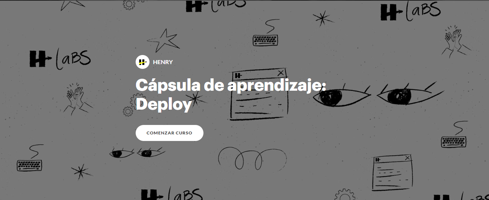

# **💪 HW3 | Sequelize Part 2 - Integration**

## **🕒 DURACIÓN ESTIMADA**

XX minutos

<br />

---

<div align="center">

## **💻 RICK AND MORTY APP 💻**

</div>

## **📝 INTRODUCCIÓN**

En esta homework nos encargaremos de terminar de integrar una base de datos en nuestro proyecto de Rick and Morty componiendo nuevos controladores.

</br >

---

## **📋 INSTRUCCIONES**

Para esta primera homework ya no necesitaremos algunos archivos y carpetas, por lo que te invitamos a eliminar los siguiente:

-  Caperta **`utils`** con todo lo que tiene dentro.
-  Archivo **`/controllers/handleFavorites.js`**.
-  Archivo **`/controllers/login.js`**.

<br />

### **👩‍💻 EJERCICIO 01 | POST USER**

Dirígete a tu carpeta **controllers**:

1. Crea un nuevo archivo con el nombre **`postUser.js`**.

2. Dentro de este archivo tendrás que importar tu modelo **User**.

> [**NOTA**]: deberás importar este modelo de tu archivo **`DB_connection`** ya que desde allí está activo dentro de tu base de datos.

3. Crea una función llamada **`postUser`** y expórtala. Esta función debe recibir por parámetro los objetos **`req`** y **`res`**. Además, esta función es asincrónica, ¡por lo que deberás trabajar con promesas o async await!

4. Dentro de la función deberás recibir un **email** y una **password** por **`Body`**.

5. Una vez recibido, deberás validar que realmente hayas recibido ambos y que no sean, por ejemplo, un string vacío. En el caso de no recibir alguno de los dos deberás responder con un **`status 400`** y devolver un mensaje que diga: **"_Faltan datos_"**.

6. En el caso de si recibir ambos datos deberás guardarlos dentro de tu modelo. Una vez realizado responde con el usuario guardado.

> [**NOTA**]: puedes utilizar el método **`findOrCreate`**.

> [**NOTA**]: en el caso de haber un error responde con **`status 500`** y el mensaje del error.

</br>

---

### **👩‍💻 EJERCICIO 02 | LOGIN**

Ahora si crearemos un controlador que valide la información de nuestra base de datos. Elimina por completo la carpeta **utils**.

1. Crea un archivo llamado **`login.js`**. Dentro de este archivo deberás importar tu modelo **User**.

2. Crea una función llamada **`login`** la cual reciba por parámetro los objetos **`req`** y **`res`**. No olvides exportarla.

3. Recibiras por **`Query`** los datos **email** y **password**.

4. En el caso de no recibir alguno de los datos, responde con un **`status 400`** y el mensaje **"_Faltan datos_"**.

5. Si ambos datos llegan correctamente tendrás que buscar aquel usuario que tenga el mismo email que recibiste anteriormente. En el caso de no encontrarlo responde con un **`status 404`** y el mensaje **"_Usuario no encontrado_"**.

6. En el caso de encontrar a un usuario con ese mismo email solo tendrás ahora que comparar si su **password** es igual a la **password** que recibiste anteriormente. En el caso de no serlo responde con un **`status 403`** y un mensaje que diga **"_Contraseña incorrecta_"**.

7. En el caso de que las contraseñas si coincidan, responde con el objeto:

```js
{
   access: true;
}
```

> [**NOTA**]: en el caso de haber un error responde con **`status 500`** y el mensaje del error.

</br>

---

### **👩‍💻 EJERCICIO 03 | POST FAV**

1. Crea un nuevo archivo llamado **`postFav.js`**. Dentro de este archivo deberás importar tu modelo **Favorite**.

2. Crea una función llamada **`postFav`** la cual reciba por parámetro los objetos **`req`** y **`res`**.

3. Deberás recibir las propiedades **name**, **origin**, **status**, **image**, **species** y **gender** por **`Body`**.

4. Valida que todos los datos estén llegando correctamente. Caso contrario responde con un **`status 401`** y el mensaje **"_Faltan datos_"**.

5. Si todos los datos llegan como corresponde, guarda tu personaje en la base de datos.

6. Una vez guardado, busca todos los personajes favoritos guardados en tu base de datos y responde con ese arreglo.

> [**NOTA**]: puedes utilizar el método **`findOrCreate`**.

> [**NOTA**]: en el caso de haber un error responde con **`status 500`** y el mensaje del error.

</br>

---

### **👩‍💻 EJERCICIO 04 | DELETE FAV**

1. Crea un nuevo archivo con el nombre **`deleteFav.js`**. Dentro de este archivo tendrás que importar tu modelo **Favorite**.

2. Crea una función con el nombre **`deleteFav`** y expórtala. Esta función debes recibir por parámetro los objetos **`req`** y **`res`**.

3. Recibirás un **id** por parámetro. Tendrás que eliminar este personaje de tu tabla de favoritos.

4. Finalmente responde con una arreglo que contenga a todos tus personajes favoritos.

> [**NOTA**]: puedes utilizar el query: **`destroy`**.

> [**NOTA**]: en el caso de haber un error responde con **`status 500`** y el mensaje del error.

</br>

---

### **👩‍💻 EJERCICIO 05 | Update routes**

Dirígete a tu archivo **`/routes/index.js`**. Dentro de este tendrás que importar tus nuevos controladores y aplicarlos en las rutas correspondientes. Las nuevas rutas deben ser las siguientes:

-  **GET** **`/login`**
-  **POST** **`/login`**
-  **POST** **`/fav`**
-  **DELETE** **`/fav/:id`**

> [**NOTA**]: la única ruta que no se modifica es **`getCharById`**.

</br>

---

### **👩‍💻 EJERCICIO 06 | Usuario de prueba**

Antes de ir a probar nuestra aplicación tendremos que crear un usuario en nuestra base de datos.

Lo normal es que en nuestro Front-End exista un formulario **`sign up`** o **`registrate`**, pero nosotros no tenemos un (aún 😏).

Tendremos que crear un usuario manualemente. Para esto abre tu **Cliente API** favorito. Puede ser, por ejemplo:

-  [**Thunder Client**](https://www.thunderclient.com/)
-  [**Insomnia**](https://www.postman.com/)
-  [**Postman**](https://insomnia.rest/download)

1. Has un request de tipo **POST** a la ruta **`http://localhost:3001/rickandmorty/login`**.

2. Tendrás que enviar por **BODY** los datos: **`email`** y **`password`**.

</br>

---

<div align="center">

## **😁 ¡FELICITACIONES! 😁**

</div>

😎 Acabas de finalizar la homework integradora del bootcamp. Tu aplicación está lista para ser utilizada.

🤓 Por supuesto que hay muchas cosas que se pueden mejorar y cosas nuevas que se pueden crear. Con todo lo que has aprendido hasta ahora ya eres capaz de continuar, con un poco de esfuerzo y autonomía, mejorando este proyecto.

🔎 Ahora queremos invitarte a que hagas un deploy de tu proyecto. Te compartimos nuestra cápsula de deploy...

<div align="center">
   <a href="https://rise.articulate.com/share/YKtorcVy0_ch_T7ETfudX4olPcYcXE6o#/">
      
   </a>
</div>

> [**NOTA**]: has click sobre la imagen.

</br>

---

## **📌 EXTRA CREDIT**

1. El primer ejercicio **`extra`** que te invitamos a desarrollar es un formulario del lado Front-End que le permita a un usuario registrarse en tu aplicación. Estos datos se guardarán automáticamente en la base de datos.

Este es un gran desafío, porque no solo tendrás que conectar tu Servidor con el Cliente, sino que también tendrás que pensar en una lógica del lado Front-End para que el usuario pueda cambiar de vista para poder logearse, y sin que aún tenga acceso a la app.

</br >

2. Algunos de los tests que realizaste en el módulo 3 ya no te serviran con estas nuevas rutas. Por lo tanto puedes intentar volver a realizar los tests, pero con las nuevas rutas.
